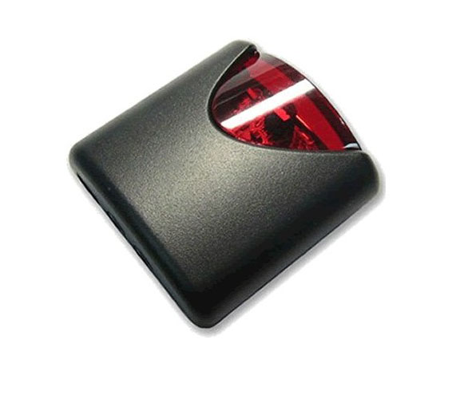

# libreelec-lirc-remote-config

A tutorial to explain how to setup a new ir remote by using **Lirc** service in **Libreelec distribution**.

> :memo: Tutorial tested in **December 2017** on **Libreelec.Generic.x86_64 rev: 8.2.1**

## Prerequisites

`LIRC` feature must be enabled in your system by using `Libreelec Menu Settings` like :


## My hardware configuration

IR Remote | IR Receiver
--------- | -----------
KONIG IR Remote CMP-MEDIAREM12 | USB IR Receiver IR606
 | 


## Somes explications

Configure a IR remote is not easy. Each remote have particular driver, table and keymap. Before to start the configuration, you must identified these different information :
* driver *(i.e. mceusb)*
* table *(i.e. rc-rc6-mce)*
* keymap *(i.e. hauppage)*

You can identify this information by running this command :
```
> ir-keytable
Found /sys/class/rc/rc0/ (/dev/input/event17) with:
	Driver mceusb, table rc-rc6-mce
	Supported protocols: lirc rc-5 rc-5-sz jvc sony nec sanyo mce_kbd rc-6 sharp xmp 
	Enabled protocols: lirc nec 
	Name: Media Center Ed. eHome Infrared 
	bus: 3, vendor/product: 147a:e042, version: 0x1201
	Repeat delay = 500 ms, repeat period = 125 ms
```

## Installation

### First Method : You owned a remote with a particular keymap (i.e. Konig CMP-MEDIAREM12)

1. Copy the `keymap file` in `/storage/.config/rc_keymaps/` 
```
cp /storage/konig_remote /storage/.config/rc_keymaps/.
```
2. Copy and rename `rc_maps.cfg.sample` to `rc_maps.cfg` :
```
cp /storage/.config/rc_maps.cfg.sample /storage/.config/rc_maps.cfg
```
3. Edit `rc_maps.cfg` to add new line at the end of file :
```
echo 'mceusb		rc-rc6-mce	konig_remote' > /storage/.config/rc_maps.cfg
```
4. Fix the permission of `rc_maps.cfg`
```
chmod 664 /storage/.config/rc_maps.cfg
```
> :warning: **Important** LIRC service won't considere `rc_maps.cfg` if it is set with incorrect permission.

5. Reboot your system to apply changes

### Second Method : You owned a remote with a keymap supported by system (/usr/lib/udev/rc_keymaps)

1. Copy and rename `rc_maps.cfg.sample` to `rc_maps.cfg` :
```
cp /storage/.config/rc_maps.cfg.sample /storage/.config/rc_maps.cfg
```
3. Edit `rc_maps.cfg` to add new line at the end of file, with your driver, table and keymap name :
```
echo 'drivers_name		table_name	keymap_name' > /storage/.config/rc_maps.cfg
```
4. Fix the permission of `rc_maps.cfg`
```
chmod 664 /storage/.config/rc_maps.cfg
```
> :warning: **Important** LIRC service won't considere `rc_maps.cfg` if it is set with incorrect permission.

5. Reboot your system to apply changes
