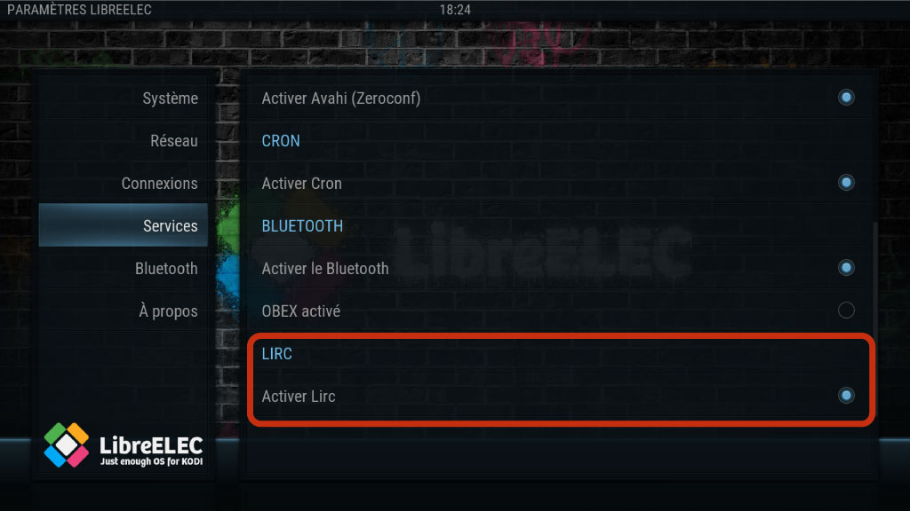

# libreelec-lirc-remote-config

A tutorial to explain how to setup a new ir remote by using lirc service in **Libreelec distribution**.

## Prerequisites

`LIRC` feature must be enabled in your system by using `Libreelec Menu Settings` like :

## Configuration

* KONIG IR Remote CMP-MEDIAREM12

* USB IR Receiver IR606

